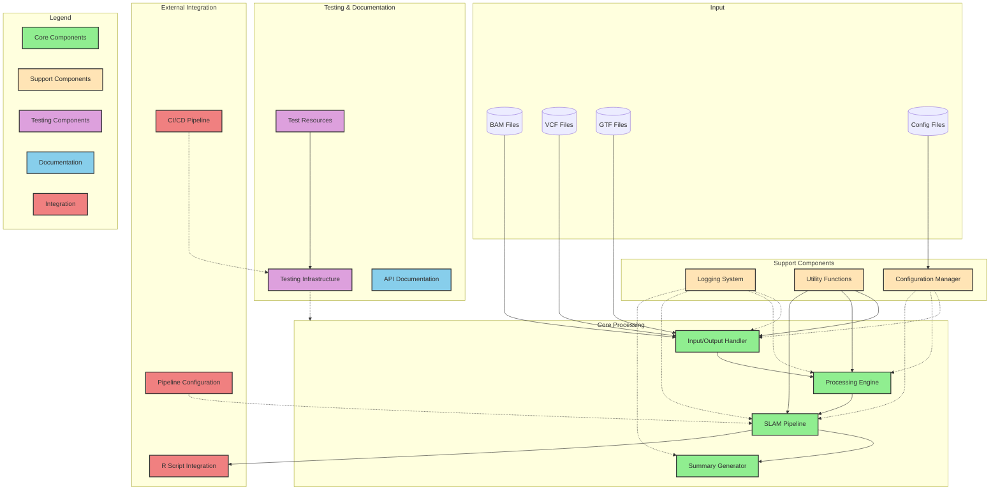

# Workflow

This page gives an overview of the workflow undertaken by IsoSLAM, it is a **WORK IN PROGRESS** as the code base is
underoing refactoring.

- This is very much a work in progress and is not yet complete. Contributions are welcome.



The above diagram is written in [Mermaid][mermaid] and generated using [GitDiagram][gitdiagram]. You can view the source
code in the IsoSLAM repository and develop/modify it using the [Mermaid Live Editor][mermaid-live] and make
pull-requests to update this documentation.

## IsoSLAM

A number of pre-processing steps are undertaken prior to IsoSLAM work being done. The following is work in progress as
the code is refactored.

1. Iterate over `.bam` file and pair segments. If two or more `AlignedSegments` with the same `query_name` are found
   then `n > 1` segments are dropped.
2. Pairs of segments (individual `AlignedSegments`) are then assessed and if they are `Assigned` the `start`, `end`,
   `length`, `status` (i.e. `Assigned`), `transcript_id`, `block_start` and `block_end` are extracted.

## Descriptive Workflow

<!-- markdownlint-disable MD033 -->
<style>
body {
    counter-reset: h3counter;
}
h3 {
    counter-increment: h3counter;
}
h3:before {
    content: counter(h3counter) ". ";
}
</style>

### Read alignments are loaded

### The gene transcript these are within are identified

### Introns within these genes are identified

### Retain reads that are overlap with introns or splice ends

```text
                                                 Genome ----------------------->

Read Alignment Blocks                     |>>>>|                     |>>>>>>>>>>>>>>>|
Transcript 1:                      |===========|---------------------|=========|-------------------|==========|
Transcript 2:              |====|------------------------------------|=========|-------------------|==========|

Introns[0]                                      ---------------------
Introns[1]                                                                      -------------------
Introns[2]                       ------------------------------------
Introns[3]                                                                      -------------------

Exon : |========|   Read alignment block:  |>>>>>|
```

[gitdiagram]: https://gitdiagram.com/sudlab/IsoSLAM
[mermaid]: https://mermaid.js.org/
[mermaid-live]: https://mermaid.live
