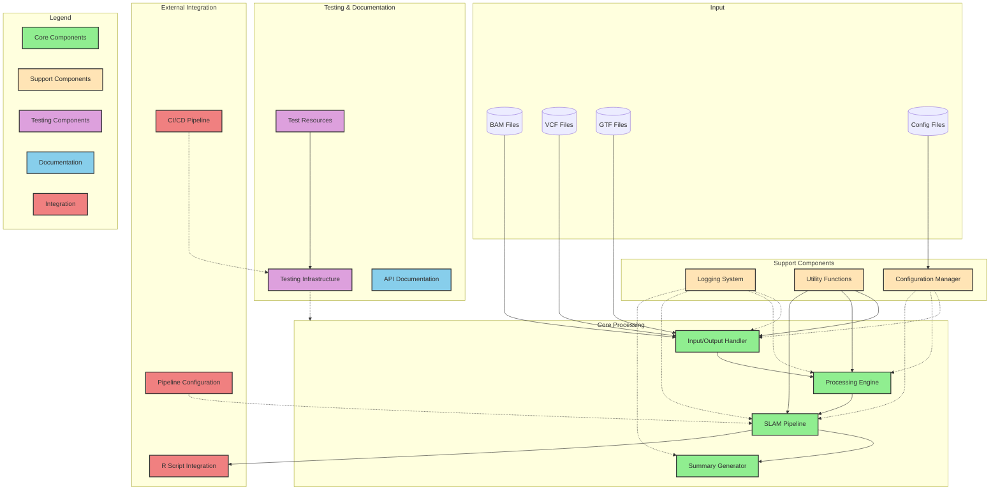

# Workflow

This page gives an overview of the workflow undertaken by IsoSLAM, it is a **WORK IN PROGRESS** as the code base is
underoing refactoring.

- This is very much a work in progress and is not yet complete. Contributions are welcome.



The above diagram is written in [Mermaid][mermaid] and generated using [GitDiagram][gitdiagram]. You can view the source
code in the IsoSLAM repository and develop/modify it using the [Mermaid Live Editor][mermaid-live] and make
pull-requests to update this documentation.

## IsoSLAM

A number of pre-processing steps are undertaken prior to IsoSLAM work being done. The following is work in progress as
the code is refactored.

1. Iterate over `.bam` file and pair segments. If two or more `AlignedSegments` with the same `query_name` are found
   then `n > 1` segments are dropped.
2. Pairs of segments (individual `AlignedSegments`) are then assessed and if they are `Assigned` the `start`, `end`,
   `length`, `status` (i.e. `Assigned`), `transcript_id`, `block_start` and `block_end` are extracted.

## Descriptive Workflow

<!-- markdownlint-disable MD033 -->
<style>
body {
    counter-reset: h3counter;
}
h3 {
    counter-increment: h3counter;
}
h3:before {
    content: counter(h3counter) ". ";
}
</style>

### Read alignments are loaded

### The gene transcript these are within are identified

### Introns within these genes are identified

### Retain reads that are overlap with introns or splice ends

```text
                                                 Genome ----------------------->

Read Alignment Blocks                     |>>>>|                     |>>>>>>>>>>>>>>>|
Transcript 1:                      |===========|---------------------|=========|-------------------|==========|
Transcript 2:              |====|------------------------------------|=========|-------------------|==========|

Introns[0]                                      ---------------------
Introns[1]                                                                      -------------------
Introns[2]                       ------------------------------------
Introns[3]                                                                      -------------------

Exon : |========|   Read alignment block:  |>>>>>|
```

## Statistical Analysis

Non-linear exponential regression models are fitted for each transcript and isoform (in terms of
`start`/`end`/`strand`/`assignment`). Because replicate analyses are performed some data preparation is required before
fitting the model to determine the "average" percentage of conversions and to derive appropriate weights since we can
be more confident in this percentage change when we have observed more events in total.

### Data Preparation

Described below are the different steps in preparing the data. The `Statistics`` dataclass exists to which loads and
aggregates the data and performs the necessary steps described below.

**NB** The excerpts below are from the regression test suite and can be found in the GitHub repository under
`tests/_regtest_outputs` and correspond to the relevant test.

<style>
body {
    counter-reset: h4counter;
}
h4 {
    counter-increment: h4counter;
}
h4:before {
    content: counter(h4counter) ". ";
}
</style>

#### Initial Data Structure

After initial processing with `isoslam` there are multiple files in either `csv`, `tsv` or `parquet` format with the
columns `Read_UID`, `Transcript_id`, `Start`, `End`, `Chr`, `Strand`, `Assignment`, `Conversions`, `Convertible`,
`Coverage`. The transcript `ENST00000313949` is shown below.

**NB** For convenience the filenames have been truncated to show only the day, hour and replicate, in real live the
filenames contain more metadata about the experiments.

```tsv hl_lines="10 12 17 30"
❱ grep -n ENST00000313949 ../resources/tsv/output/d*
../resources/tsv/output/d0_0hr1.tsv:150:45      ENST00000313949    58910081        58910333        chr20   +       Spl     0       62      300\n
../resources/tsv/output/d0_0hr1.tsv:156:45      ENST00000313949    58909804        58909950        chr20   +       Spl     0       62      300
../resources/tsv/output/d0_0hr1.tsv:157:45      ENST00000313949    58909579        58909683        chr20   +       Spl     0       62      300
../resources/tsv/output/d0_0hr4.tsv:52:16       ENST00000313949    58910081        58910333        chr20   +       Spl     0       69      291
../resources/tsv/output/d0_0hr4.tsv:54:16       ENST00000313949    58910401        58910682        chr20   +       Spl     0       69      291
../resources/tsv/output/d0_0hr4.tsv:57:16       ENST00000313949    58909804        58909950        chr20   +       Spl     0       69      291
../resources/tsv/output/d0_0hr4.tsv:86:27       ENST00000313949    58910401        58910682        chr20   +       Spl     1       87      299
../resources/tsv/output/d0_12hr4.tsv:69:19      ENST00000313949    58909216        58909349        chr20   +       Spl     0       66      300
../resources/tsv/output/d0_12hr4.tsv:75:19      ENST00000313949    58903791        58905382        chr20   +       Spl     0       66      300
../resources/tsv/output/d0_12hr4.tsv:77:19      ENST00000313949    58909423        58909520        chr20   +       Spl     0       66      300
../resources/tsv/output/d0_3hr1.tsv:12:7        ENST00000313949    58903791        58905382        chr20   +       Spl     0       65      232
../resources/tsv/output/d0_3hr1.tsv:16:7        ENST00000313949    58905480        58909161        chr20   +       Spl     0       65      232
../resources/tsv/output/d0_3hr2.tsv:140:20      ENST00000313949    58909804        58909950        chr20   +       Spl     1       70      218
../resources/tsv/output/d16_0hr1.tsv:47:11      ENST00000313949    58909579        58909683        chr20   +       Spl     0       68      297
../resources/tsv/output/d16_0hr1.tsv:54:11      ENST00000313949    58909804        58909950        chr20   +       Spl     0       68      297
../resources/tsv/output/d16_0hr1.tsv:55:11      ENST00000313949    58909423        58909520        chr20   +       Spl     0       68      297
../resources/tsv/output/d16_0hr2.tsv:31:12      ENST00000313949    58903791        58905382        chr20   +       Spl     1       68      197
../resources/tsv/output/d16_0hr2.tsv:33:12      ENST00000313949    58905480        58909161        chr20   +       Spl     1       68      197
../resources/tsv/output/d16_0hr3.tsv:85:26      ENST00000313949    58910081        58910333        chr20   +       Spl     0       70      300
../resources/tsv/output/d16_0hr3.tsv:86:26      ENST00000313949    58909423        58909520        chr20   +       Spl     0       70      300
../resources/tsv/output/d16_0hr3.tsv:91:26      ENST00000313949    58909579        58909683        chr20   +       Spl     0       70      300
../resources/tsv/output/d16_0hr3.tsv:98:28      ENST00000313949    58909804        58909950        chr20   +       Spl     0       72      300
../resources/tsv/output/d16_0hr3.tsv:99:28      ENST00000313949    58909423        58909520        chr20   +       Spl     0       72      300
../resources/tsv/output/d16_0hr3.tsv:104:28     ENST00000313949    58909579        58909683        chr20   +       Spl     0       72      300
../resources/tsv/output/d16_3hr1.tsv:165:56     ENST00000313949    58909579        58909683        chr20   +       Spl     0       68      300
../resources/tsv/output/d16_3hr1.tsv:166:56     ENST00000313949    58909423        58909520        chr20   +       Spl     0       68      300
../resources/tsv/output/d16_3hr1.tsv:169:56     ENST00000313949    58909804        58909950        chr20   +       Spl     0       68      300
../resources/tsv/output/d16_3hr3.tsv:11:4       ENST00000313949    58910401        58910682        chr20   +       Spl     1       65      289
../resources/tsv/output/d16_3hr3.tsv:16:4       ENST00000313949    58910081        58910333        chr20   +       Spl     1       65      289
../resources/tsv/output/d16_3hr3.tsv:69:22      ENST00000313949    58903791        58905382        chr20   +       Spl     0       57      266
../resources/tsv/output/d16_3hr3.tsv:71:22      ENST00000313949    58903585        58903671        chr20   +       Spl     0       57      266
../resources/tsv/output/d16_no4sU.tsv:56:19     ENST00000313949    58910401        58910682        chr20   +       Spl     0       64      235
../resources/tsv/output/d16_no4sU.tsv:57:19     ENST00000313949    58910081        58910333        chr20   +       Spl     0       64      235
../resources/tsv/output/d2_12hr1.tsv:119:41     ENST00000313949    58905480        58909161        chr20   +       Spl     1       65      249
../resources/tsv/output/d2_12hr1.tsv:121:41     ENST00000313949    58909216        58909349        chr20   +       Spl     1       65      249
../resources/tsv/output/d2_12hr1.tsv:122:41     ENST00000313949    58909423        58909520        chr20   +       Spl     1       65      249
```

#### Summarise Counts

Having processed multiple files the data is aggregated into a single large dataframe by the `summary.summary_counts()`
function. The `Chr` column has been dropped as it is consistent with the `Transcript_id`, it is not lost however and is
retained and added back in at the end, it just removes a level of indexing when performing `group_by()` operations. Note
also after this aggregation process the data is _not_ sorted by `day` or `hour`.

We can see that for transcript `ENST00000313949` (on Chromosome 20) starting at `58903791` and ending at `58905382`
there are observed events at day 0, hours 3 and 12 and day 16 at hours 0 and 3, but only one had an observed conversion.

**TODO** Check why `conversion_count` is `1\*\* for these events, surely it should be zero?

**TODO** Possibly remove other lines to make it easier to read, but leave a few around it in place.

```csv hl_lines="3 4 5 6 21 22 23 24 25 26"
Transcript_id,Strand,Start,End,Assignment,filename,one_or_more_conversion,conversion_count,conversion_total,conversion_percent,day,hour,replicate
ENST00000313949,+,58903585,58903671,Spl,d16_3hr3,false,1,1,1.0,16,3,3
ENST00000313949,+,58903791,58905382,Spl,d0_12hr4,false,1,1,1.0,0,12,4
ENST00000313949,+,58903791,58905382,Spl,d0_3hr1,false,1,1,1.0,0,3,1
ENST00000313949,+,58903791,58905382,Spl,d16_0hr2,true,1,1,1.0,16,0,2
ENST00000313949,+,58903791,58905382,Spl,d16_3hr3,false,1,1,1.0,16,3,3
ENST00000313949,+,58905480,58909161,Spl,d0_3hr1,false,1,1,1.0,0,3,1
ENST00000313949,+,58905480,58909161,Spl,d16_0hr2,true,1,1,1.0,16,0,2
ENST00000313949,+,58905480,58909161,Spl,d2_12hr1,true,1,1,1.0,2,12,1
ENST00000313949,+,58909216,58909349,Spl,d0_12hr4,false,1,1,1.0,0,12,4
ENST00000313949,+,58909216,58909349,Spl,d2_12hr1,true,1,1,1.0,2,12,1
ENST00000313949,+,58909423,58909520,Spl,d0_12hr4,false,1,1,1.0,0,12,4
ENST00000313949,+,58909423,58909520,Spl,d16_0hr1,false,1,1,1.0,16,0,1
ENST00000313949,+,58909423,58909520,Spl,d16_0hr3,false,2,2,1.0,16,0,3
ENST00000313949,+,58909423,58909520,Spl,d16_3hr1,false,1,1,1.0,16,3,1
ENST00000313949,+,58909423,58909520,Spl,d2_12hr1,true,1,1,1.0,2,12,1
ENST00000313949,+,58909579,58909683,Spl,d0_0hr1,false,1,1,1.0,0,0,1
ENST00000313949,+,58909579,58909683,Spl,d16_0hr1,false,1,1,1.0,16,0,1
ENST00000313949,+,58909579,58909683,Spl,d16_0hr3,false,2,2,1.0,16,0,3
ENST00000313949,+,58909579,58909683,Spl,d16_3hr1,false,1,1,1.0,16,3,1
ENST00000313949,+,58909804,58909950,Spl,d0_0hr1,false,1,1,1.0,0,0,1
ENST00000313949,+,58909804,58909950,Spl,d0_0hr4,false,1,1,1.0,0,0,4
ENST00000313949,+,58909804,58909950,Spl,d0_3hr2,true,1,1,1.0,0,3,2
ENST00000313949,+,58909804,58909950,Spl,d16_0hr1,false,1,1,1.0,16,0,1
ENST00000313949,+,58909804,58909950,Spl,d16_0hr3,false,1,1,1.0,16,0,3
ENST00000313949,+,58909804,58909950,Spl,d16_3hr1,false,1,1,1.0,16,3,1
ENST00000313949,+,58910081,58910333,Spl,d0_0hr1,false,1,1,1.0,0,0,1
ENST00000313949,+,58910081,58910333,Spl,d0_0hr4,false,1,1,1.0,0,0,4
ENST00000313949,+,58910081,58910333,Spl,d16_0hr3,false,1,1,1.0,16,0,3
ENST00000313949,+,58910081,58910333,Spl,d16_3hr3,true,1,1,1.0,16,3,3
ENST00000313949,+,58910401,58910682,Spl,d0_0hr4,false,1,2,0.5,0,0,4
ENST00000313949,+,58910401,58910682,Spl,d0_0hr4,true,1,2,0.5,0,0,4
ENST00000313949,+,58910401,58910682,Spl,d16_3hr3,true,1,1,1.0,16,3,3
```

#### Aggregate Counts

```csv hl_lines="3 4 5 6 21 22 23 24 25 26"
Transcript_id,Strand,Start,End,Assignment,day,hour,replicate,len,one_or_more_conversion
ENST00000313949,+,58903585,58903671,Spl,16,3,3,1,false
ENST00000313949,+,58903791,58905382,Spl,0,3,1,1,false
ENST00000313949,+,58903791,58905382,Spl,0,12,4,1,false
ENST00000313949,+,58903791,58905382,Spl,16,0,2,1,true
ENST00000313949,+,58903791,58905382,Spl,16,3,3,1,false
ENST00000313949,+,58905480,58909161,Spl,0,3,1,1,false
ENST00000313949,+,58905480,58909161,Spl,2,12,1,1,true
ENST00000313949,+,58905480,58909161,Spl,16,0,2,1,true
ENST00000313949,+,58909216,58909349,Spl,0,12,4,1,false
ENST00000313949,+,58909216,58909349,Spl,2,12,1,1,true
ENST00000313949,+,58909423,58909520,Spl,0,12,4,1,false
ENST00000313949,+,58909423,58909520,Spl,2,12,1,1,true
ENST00000313949,+,58909423,58909520,Spl,16,0,1,1,false
ENST00000313949,+,58909423,58909520,Spl,16,0,3,1,false
ENST00000313949,+,58909423,58909520,Spl,16,3,1,1,false
ENST00000313949,+,58909579,58909683,Spl,0,0,1,1,false
ENST00000313949,+,58909579,58909683,Spl,16,0,1,1,false
ENST00000313949,+,58909579,58909683,Spl,16,0,3,1,false
ENST00000313949,+,58909579,58909683,Spl,16,3,1,1,false
ENST00000313949,+,58909804,58909950,Spl,0,0,1,1,false
ENST00000313949,+,58909804,58909950,Spl,0,0,4,1,false
ENST00000313949,+,58909804,58909950,Spl,0,3,2,1,true
ENST00000313949,+,58909804,58909950,Spl,16,0,1,1,false
ENST00000313949,+,58909804,58909950,Spl,16,0,3,1,false
ENST00000313949,+,58909804,58909950,Spl,16,3,1,1,false
ENST00000313949,+,58910081,58910333,Spl,0,0,1,1,false
ENST00000313949,+,58910081,58910333,Spl,0,0,4,1,false
ENST00000313949,+,58910081,58910333,Spl,16,0,3,1,false
ENST00000313949,+,58910081,58910333,Spl,16,3,3,1,true
ENST00000313949,+,58910401,58910682,Spl,0,0,4,2,false
ENST00000313949,+,58910401,58910682,Spl,16,3,3,1,true
```

#### Filter No Conversions

The aggregation process can result in some missing observations where there have been observed reads but no conversions
observed. Such data points need including and so we derive a subset of instances and make dummies.

```csv hl_lines="3 4 5 16 17 18 19 20"
Transcript_id,Strand,Start,End,Assignment,day,hour,replicate,one_or_more_conversion
ENST00000313949,+,58903585,58903671,Spl,16,3,3,false
ENST00000313949,+,58903791,58905382,Spl,0,3,1,false
ENST00000313949,+,58903791,58905382,Spl,0,12,4,false
ENST00000313949,+,58903791,58905382,Spl,16,3,3,false
ENST00000313949,+,58905480,58909161,Spl,0,3,1,false
ENST00000313949,+,58909216,58909349,Spl,0,12,4,false
ENST00000313949,+,58909423,58909520,Spl,0,12,4,false
ENST00000313949,+,58909423,58909520,Spl,16,0,1,false
ENST00000313949,+,58909423,58909520,Spl,16,0,3,false
ENST00000313949,+,58909423,58909520,Spl,16,3,1,false
ENST00000313949,+,58909579,58909683,Spl,0,0,1,false
ENST00000313949,+,58909579,58909683,Spl,16,0,1,false
ENST00000313949,+,58909579,58909683,Spl,16,0,3,false
ENST00000313949,+,58909579,58909683,Spl,16,3,1,false
ENST00000313949,+,58909804,58909950,Spl,0,0,1,false
ENST00000313949,+,58909804,58909950,Spl,0,0,4,false
ENST00000313949,+,58909804,58909950,Spl,16,0,1,false
ENST00000313949,+,58909804,58909950,Spl,16,0,3,false
ENST00000313949,+,58909804,58909950,Spl,16,3,1,false
ENST00000313949,+,58910081,58910333,Spl,0,0,1,false
ENST00000313949,+,58910081,58910333,Spl,0,0,4,false
ENST00000313949,+,58910081,58910333,Spl,16,0,3,false
```

#### Extract One or More Conversions

We flip the `one_or_more_conversion` to be `true` here and the `conversion_count` and `convesrion_percent` is set to `0`
and `0.0` for the day/hour/replicates we observed zero conversions and the data is combined with those that did have
conversions so that we have a complete data set.

```csv hl_lines="3 4 5 6 21 22 23 24 25 26"
Transcript_id,Strand,Start,End,Assignment,day,hour,replicate,one_or_more_conversion,conversion_count,conversion_total,conversion_percent
ENST00000313949,+,58903585,58903671,Spl,16,3,3,true,0,1,0.0
ENST00000313949,+,58903791,58905382,Spl,0,3,1,true,0,1,0.0
ENST00000313949,+,58903791,58905382,Spl,0,12,4,true,0,1,0.0
ENST00000313949,+,58903791,58905382,Spl,16,0,2,true,1,1,1.0
ENST00000313949,+,58903791,58905382,Spl,16,3,3,true,0,1,0.0
ENST00000313949,+,58905480,58909161,Spl,0,3,1,true,0,1,0.0
ENST00000313949,+,58905480,58909161,Spl,2,12,1,true,1,1,1.0
ENST00000313949,+,58905480,58909161,Spl,16,0,2,true,1,1,1.0
ENST00000313949,+,58909216,58909349,Spl,0,12,4,true,0,1,0.0
ENST00000313949,+,58909216,58909349,Spl,2,12,1,true,1,1,1.0
ENST00000313949,+,58909423,58909520,Spl,0,12,4,true,0,1,0.0
ENST00000313949,+,58909423,58909520,Spl,2,12,1,true,1,1,1.0
ENST00000313949,+,58909423,58909520,Spl,16,0,1,true,0,1,0.0
ENST00000313949,+,58909423,58909520,Spl,16,0,3,true,0,2,0.0
ENST00000313949,+,58909423,58909520,Spl,16,3,1,true,0,1,0.0
ENST00000313949,+,58909579,58909683,Spl,0,0,1,true,0,1,0.0
ENST00000313949,+,58909579,58909683,Spl,16,0,1,true,0,1,0.0
ENST00000313949,+,58909579,58909683,Spl,16,0,3,true,0,2,0.0
ENST00000313949,+,58909579,58909683,Spl,16,3,1,true,0,1,0.0
ENST00000313949,+,58909804,58909950,Spl,0,0,1,true,0,1,0.0
ENST00000313949,+,58909804,58909950,Spl,0,0,4,true,0,1,0.0
ENST00000313949,+,58909804,58909950,Spl,0,3,2,true,1,1,1.0
ENST00000313949,+,58909804,58909950,Spl,16,0,1,true,0,1,0.0
ENST00000313949,+,58909804,58909950,Spl,16,0,3,true,0,1,0.0
ENST00000313949,+,58909804,58909950,Spl,16,3,1,true,0,1,0.0
ENST00000313949,+,58910081,58910333,Spl,0,0,1,true,0,1,0.0
ENST00000313949,+,58910081,58910333,Spl,0,0,4,true,0,1,0.0
ENST00000313949,+,58910081,58910333,Spl,16,0,3,true,0,1,0.0
ENST00000313949,+,58910081,58910333,Spl,16,3,3,true,1,1,1.0
ENST00000313949,+,58910401,58910682,Spl,0,0,4,true,1,2,0.5
ENST00000313949,+,58910401,58910682,Spl,16,3,3,true,1,1,1.0
```

#### Calculate Percentage of Conversions Across Replicates

Note that for the transcript with start/end `58909804`/`58909950` we have four rows as there was a replicated
observation on day `0` at hour `0`.

```csv hl_lines="3 4 5 6 18 19 20 21"
Transcript_id,Strand,Start,End,Assignment,day,hour,conversion_count,conversion_total,conversion_percent
ENST00000313949,+,58903585,58903671,Spl,16,3,0,1,0.0
ENST00000313949,+,58903791,58905382,Spl,0,3,0,1,0.0
ENST00000313949,+,58903791,58905382,Spl,0,12,0,1,0.0
ENST00000313949,+,58903791,58905382,Spl,16,0,1,1,100.0
ENST00000313949,+,58903791,58905382,Spl,16,3,0,1,0.0
ENST00000313949,+,58905480,58909161,Spl,0,3,0,1,0.0
ENST00000313949,+,58905480,58909161,Spl,2,12,1,1,100.0
ENST00000313949,+,58905480,58909161,Spl,16,0,1,1,100.0
ENST00000313949,+,58909216,58909349,Spl,0,12,0,1,0.0
ENST00000313949,+,58909216,58909349,Spl,2,12,1,1,100.0
ENST00000313949,+,58909423,58909520,Spl,0,12,0,1,0.0
ENST00000313949,+,58909423,58909520,Spl,2,12,1,1,100.0
ENST00000313949,+,58909423,58909520,Spl,16,0,0,3,0.0
ENST00000313949,+,58909423,58909520,Spl,16,3,0,1,0.0
ENST00000313949,+,58909579,58909683,Spl,0,0,0,1,0.0
ENST00000313949,+,58909579,58909683,Spl,16,0,0,3,0.0
ENST00000313949,+,58909579,58909683,Spl,16,3,0,1,0.0
ENST00000313949,+,58909804,58909950,Spl,0,0,0,2,0.0
ENST00000313949,+,58909804,58909950,Spl,0,3,1,1,100.0
ENST00000313949,+,58909804,58909950,Spl,16,0,0,2,0.0
ENST00000313949,+,58909804,58909950,Spl,16,3,0,1,0.0
ENST00000313949,+,58910081,58910333,Spl,0,0,0,2,0.0
ENST00000313949,+,58910081,58910333,Spl,16,0,0,1,0.0
ENST00000313949,+,58910081,58910333,Spl,16,3,1,1,100.0
ENST00000313949,+,58910401,58910682,Spl,0,0,1,2,50.0
ENST00000313949,+,58910401,58910682,Spl,16,3,1,1,100.0
```

#### Select Base Levels

We want to normalise the data and scale the percentage of changes relative to those at baseline (`t = 0`)

```csv hl_lines="2 4"
Transcript_id,Strand,Start,End,Assignment,baseline_count,baseline_total,baseline_percent
ENST00000313949,+,58909579,58909683,Spl,0,1,0.0
ENST00000313949,+,58909804,58909950,Spl,0,2,0.0
ENST00000313949,+,58910081,58910333,Spl,0,2,0.0
ENST00000313949,+,58910401,58910682,Spl,1,2,50.0
```

#### Merge baseline with all averages

Prior to normalising the data we can merge the baseline parameters (`summary._merge_average_with_baseline()`)

At this stage we can also remove instances where the percentage change at baseline is zero using the
`remove_zero_baseline` which we would typically want to do because in the next step of normalising the data a division
by zero leads to `NaN` in the dataframe and models can not be fitted to such data.

In this example the `remove_zero_baseline = False` and we can see there are a number of locations where the
`baseline_percent` (final column) is `0.0`.

```csv
Transcript_id,Strand,Start,End,Assignment,day,hour,conversion_count,conversion_total,conversion_percent,baseline_count,baseline_total,baseline_percent
ENST00000313949,+,58909579,58909683,Spl,0,0,0,1,0.0,0,1,0.0
ENST00000313949,+,58909579,58909683,Spl,16,0,0,3,0.0,0,1,0.0
ENST00000313949,+,58909579,58909683,Spl,16,3,0,1,0.0,0,1,0.0
ENST00000313949,+,58909804,58909950,Spl,0,0,0,2,0.0,0,2,0.0
ENST00000313949,+,58909804,58909950,Spl,0,3,1,1,100.0,0,2,0.0
ENST00000313949,+,58909804,58909950,Spl,16,0,0,2,0.0,0,2,0.0
ENST00000313949,+,58909804,58909950,Spl,16,3,0,1,0.0,0,2,0.0
ENST00000313949,+,58910081,58910333,Spl,0,0,0,2,0.0,0,2,0.0
ENST00000313949,+,58910081,58910333,Spl,16,0,0,1,0.0,0,2,0.0
ENST00000313949,+,58910081,58910333,Spl,16,3,1,1,100.0,0,2,0.0
ENST00000313949,+,58910401,58910682,Spl,0,0,1,2,50.0,1,2,50.0
ENST00000313949,+,58910401,58910682,Spl,16,3,1,1,100.0,1,2,50.0
```

If we set `remove_zero_baseline = True` we get just the last instance where the percentage of conversions at baseline
was `50.0`.

```csv
Transcript_id,Strand,Start,End,Assignment,day,hour,conversion_count,conversion_total,conversion_percent,baseline_count,baseline_total,baseline_percent
ENST00000313949,+,58910401,58910682,Spl,0,0,1,2,50.0,1,2,50.0
ENST00000313949,+,58910401,58910682,Spl,16,3,1,1,100.0,1,2,50.0
```

#### Normalise mean percentages

We can now normalise the data (`summary._normalise()`) by dividing the percentage change the baseline value that we
merged in.

If we don't remove the instances where the percentage change at baseline was `0.0` then the `normalised_percent` is
`NaN` if a given time point is also `0.0` and `Inf` if any other.

```csv hl_lines="5 6 7 8 9 10 11 12"
Transcript_id,Strand,Start,End,Assignment,day,hour,conversion_count,conversion_total,conversion_percent,baseline_count,baseline_total,baseline_percent,normalised_percent
ENST00000313949,+,58909579,58909683,Spl,0,0,0,1,0.0,0,1,0.0,NaN
ENST00000313949,+,58909579,58909683,Spl,16,0,0,3,0.0,0,1,0.0,NaN
ENST00000313949,+,58909579,58909683,Spl,16,3,0,1,0.0,0,1,0.0,NaN
ENST00000313949,+,58909804,58909950,Spl,0,0,0,2,0.0,0,2,0.0,NaN
ENST00000313949,+,58909804,58909950,Spl,0,3,1,1,100.0,0,2,0.0,inf
ENST00000313949,+,58909804,58909950,Spl,16,0,0,2,0.0,0,2,0.0,NaN
ENST00000313949,+,58909804,58909950,Spl,16,3,0,1,0.0,0,2,0.0,NaN
ENST00000313949,+,58910081,58910333,Spl,0,0,0,2,0.0,0,2,0.0,NaN
ENST00000313949,+,58910081,58910333,Spl,16,0,0,1,0.0,0,2,0.0,NaN
ENST00000313949,+,58910081,58910333,Spl,16,3,1,1,100.0,0,2,0.0,inf
ENST00000313949,+,58910401,58910682,Spl,0,0,1,2,50.0,1,2,50.0,1.0
ENST00000313949,+,58910401,58910682,Spl,16,3,1,1,100.0,1,2,50.0,2.0
```

If we have already filtered out instances where the percentage change at baseline was `0.0` then we only have genuine
normalised values.

```csv hl_lines="2 3"
Transcript_id,Strand,Start,End,Assignment,day,hour,conversion_count,conversion_total,conversion_percent,baseline_count,baseline_total,baseline_percent,normalised_percent
ENST00000313949,+,58910401,58910682,Spl,0,0,1,2,50.0,1,2,50.0,1.0
ENST00000313949,+,58910401,58910682,Spl,16,3,1,1,100.0,1,2,50.0,2.0
```

#### Derive Weights

If more reads have been observed then we have greater confidence in the percentage of conversions across replicates. We
therefore use the total number of conversions across all time points to work out the proportion (/percentage) that are
derived from a given time point within the grouping and set this as the `conversion_weight`.

In the example below we have already filtered out instances where there were no conversions observed at baseline.

```csv hl_lines="2 3"
Transcript_id,Strand,Start,End,Assignment,day,hour,conversion_count,conversion_total,conversion_percent,baseline_count,baseline_total,baseline_percent,normalised_percent,conversion_total_all_time_points,conversion_weight
ENST00000313949,+,58910401,58910682,Spl,0,0,1,2,50.0,1,2,50.0,1.0,3,0.6666666666666666
ENST00000313949,+,58910401,58910682,Spl,16,3,1,1,100.0,1,2,50.0,2.0,3,0.3333333333333333
```

For convenience the above is shown in tabular format below. It may seem counter intuitive that the `conversion_total`
exceed that of the `conversion_count` at baseline but it should be remembered that these are actually the total counts
across replicates at each time point and so in one replicate there was a conversion, in another there wasn't.

| Transcript_id   | Strand | Start    | End      | Assignment | day | hour | conversion_count | conversion_total | conversion_percent | baseline_count | baseline_total | baseline_percent | normalised_percent | conversion_total_all_time_points | conversion_weight  |
| --------------- | ------ | -------- | -------- | ---------- | --- | ---- | ---------------- | ---------------- | ------------------ | -------------- | -------------- | ---------------- | ------------------ | -------------------------------- | ------------------ |
| ENST00000313949 | +      | 58910401 | 58910682 | Spl        | 0   | 0    | 1                | 2                | 50.0               | 1              | 2              | 50.0             | 1.0                | 3                                | 0.6666666666666666 |
| ENST00000313949 | +      | 58910401 | 58910682 | Spl        | 16  | 3    | 1                | 1                | 100.0              | 1              | 2              | 50.0             | 2.0                | 3                                | 0.3333333333333333 |

[gitdiagram]: https://gitdiagram.com/sudlab/IsoSLAM
[mermaid]: https://mermaid.js.org/
[mermaid-live]: https://mermaid.live
